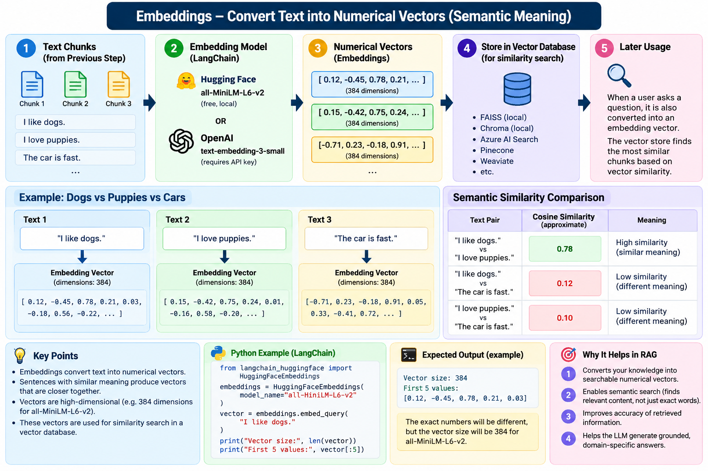

# Embeddings

## Definition

**Embeddings convert text into numerical vectors that represent semantic meaning.**

```text
Text
  ↓
Embedding Model
  ↓
[0.12, -0.45, 0.78, ...]
```

Text with similar meaning tends to produce vectors that are closer in the embedding space.

## Example

```python
from langchain_huggingface import HuggingFaceEmbeddings

embeddings = HuggingFaceEmbeddings(
    model_name="all-MiniLM-L6-v2"
)

vector = embeddings.embed_query(
    "I love programming in Python."
)

print(len(vector))
print(vector[:5])
```

With `all-MiniLM-L6-v2`, the vector has **384 dimensions**.

## Two models used in the exercises

### Hugging Face

`all-MiniLM-L6-v2`

- Runs locally
- No OpenAI API key required
- 384-dimensional vectors in this example

### OpenAI

`text-embedding-3-small`

- Runs through the OpenAI API
- Requires an API key
- Produces a different vector space and dimensionality

Different vector sizes do not by themselves mean one model is better.

## Similarity

Vectors can be compared using measures such as cosine similarity.

Example from the exercise:

```text
"I like dogs"      ↔ "I love puppies"   → high similarity
"I like dogs"      ↔ "The car is fast"  → low similarity
```

## RAG role

```text
Chunks
   ↓
Embeddings
   ↓
Vectors
   ↓
Vector Store
```

## Visual



## Repository

See `embeddings.py`, `openai_embeddings.py`, and `embedding_similarity.py`.

