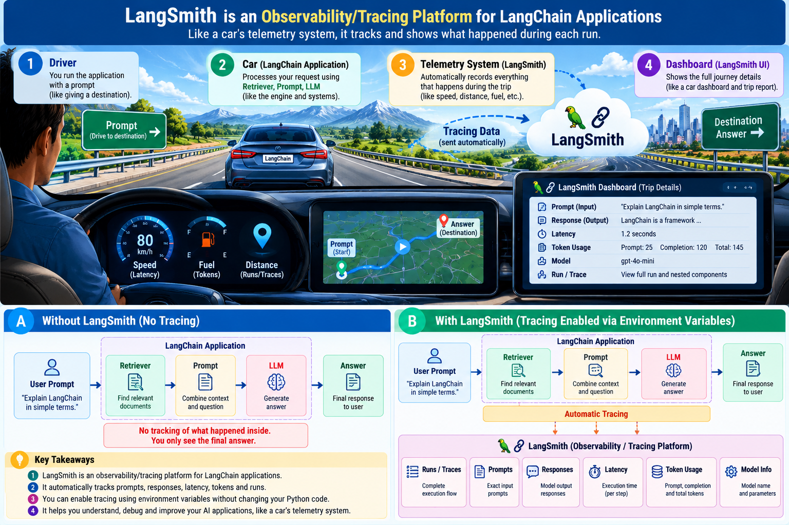
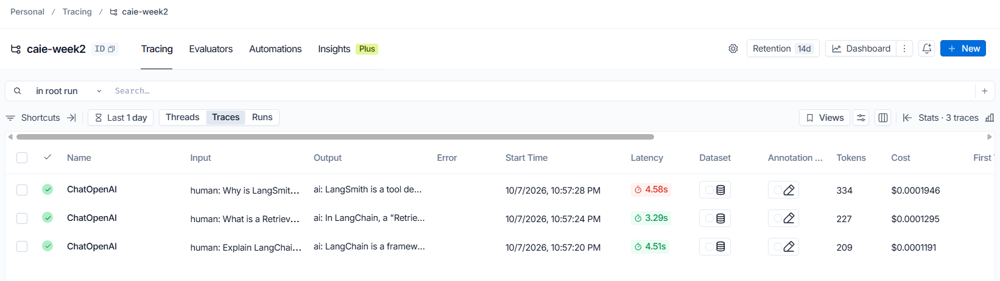
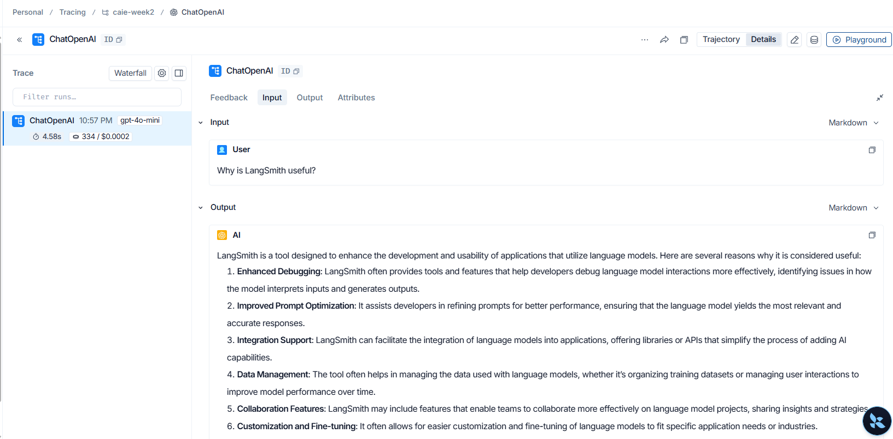

# LangSmith

## Definition

**LangSmith is an observability/tracing platform for LangChain applications.**

A useful analogy is a car's telemetry system:

```text
LangChain Application = Car
LangSmith = Telemetry / Dashboard
```

The application runs normally, while LangSmith records and displays what happened during execution.

## What can be observed?

A LangSmith run can show information such as:

- Prompt / input
- Model response / output
- Latency
- Token usage
- Model information
- Run / trace details

## The important assignment lesson

No LangSmith tracing code was added to `traced_app.py`.

Tracing was enabled through environment variables:

```text
LANGSMITH_TRACING=true
LANGSMITH_API_KEY=...
LANGSMITH_PROJECT=caie-week2
```

The application still contains ordinary LangChain code:

```python
response = llm.invoke(prompt)
```

The environment configuration enables tracing without changing the application logic.

## Why is this useful?

Observability helps answer questions such as:

- What prompt was actually sent?
- What response did the model return?
- How long did the call take?
- How many tokens were used?
- Which run failed?
- Which prompt is more expensive?

## Assignment example

Three prompts produced three traces in the `caie-week2` project:

```text
Prompt 1 → Trace 1
Prompt 2 → Trace 2
Prompt 3 → Trace 3
```

The LangSmith project view can show the three runs, while an opened run exposes the detailed execution information.

## Visuals







## Repository

See `traced_app.py`.

