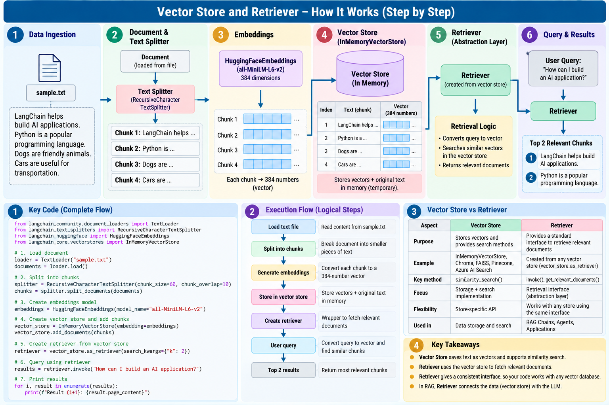
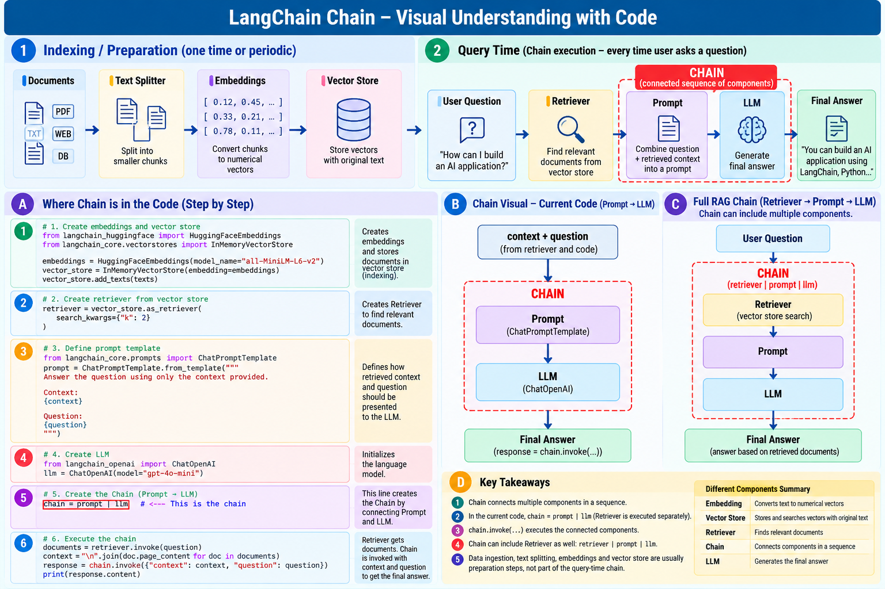

# LangChain Ecosystem

A practical reference for the core LangChain components used to build retrieval-augmented AI applications, followed by LangSmith observability.

## Learning Flow

```text
Data Ingestion
      ↓
Text Splitter
      ↓
Embeddings
      ↓
Vector Store
      ↓
Retriever
      ↓
Chain
      ↓
LLM
      ↓
Final Answer

              +------------------+
              |    LangSmith     |
              | Observability /  |
              |     Tracing      |
              +------------------+
```

### Core components

| Component | Purpose | Reference |
|---|---|---|
| [Data Ingestion](DATA_INGESTION.md) | Load external data into LangChain `Document` objects | `data_ingestion.py` |
| [Text Splitter](TEXT_SPLITTER.md) | Break documents into manageable chunks | `text_splitter.py` |
| [Embeddings](EMBEDDINGS.md) | Convert text into numerical vectors representing semantic meaning | `embeddings.py`, `openai_embeddings.py` |
| [Vector Store](VECTOR_STORE.md) | Store vectors with source text and perform similarity search | `vector_store.py`, `rag_vector_store.py` |
| [Retriever](RETRIEVER.md) | Provide a standard interface for retrieving relevant documents | `retriever.py` |
| [Chain](CHAIN.md) | Connect components into an executable sequence | `chain_execution.py` |
| [LangSmith](LANGSMITH.md) | Trace and observe LangChain application runs | `traced_app.py` |

## Two Important Pipelines

### 1. Indexing / preparation

```text
Documents → Split → Embeddings → Vector Store
```

These steps prepare knowledge for retrieval.

### 2. Query-time RAG flow

```text
User Question
      ↓
Retriever
      ↓
Relevant Context
      ↓
Prompt
      ↓
LLM
      ↓
Answer
```

The preparation steps are not normally repeated for every user question.

## Visual References

### Text Splitting


### Embeddings


### Vector Store


### Retriever


### Chain


### LangSmith


## Key Idea

LangChain is not a single model. It provides components that can be composed into application workflows.

A useful mental model is:

> **Prepare knowledge → retrieve relevant knowledge → give it to the LLM → generate an answer → observe the execution.**

LangSmith sits alongside the application as the observability/tracing layer.

## Repository Examples

- `data_ingestion.py`
- `text_splitter.py`
- `embeddings.py`
- `openai_embeddings.py`
- `embedding_similarity.py`
- `vector_store.py`
- `rag_vector_store.py`
- `retriever.py`
- `chain_execution.py`
- `traced_app.py`

