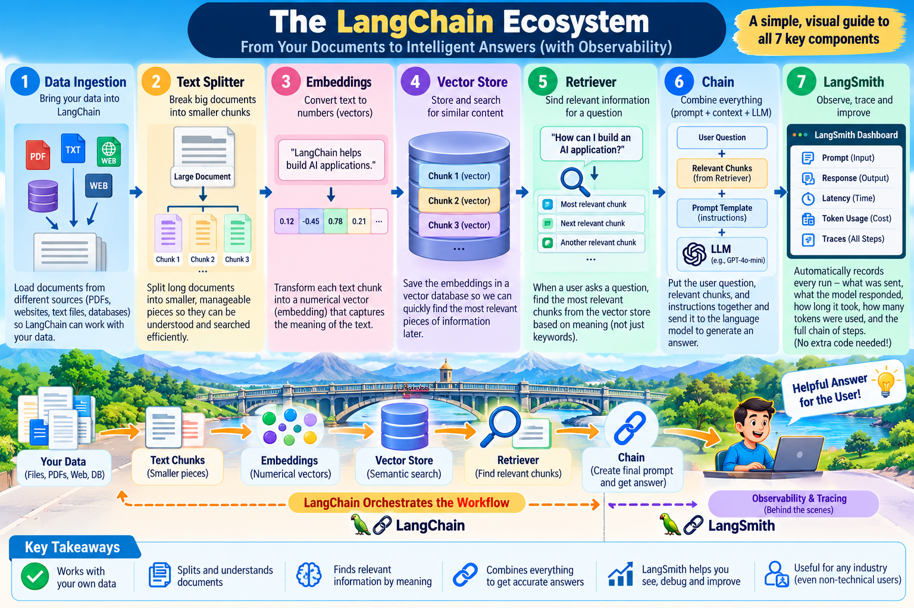

# LangChain Ecosystem

A practical reference implementation of the core LangChain workflow, from data ingestion through retrieval, chains, and LangSmith observability.

## Learning Flow

```text
Data Source
    ↓
Data Ingestion
    ↓
Text Splitter
    ↓
Embeddings
    ↓
Vector Store
    ↓
Retriever
    ↓
Chain
    ↓
LLM
    ↓
Answer

LangSmith
    ↓
Observability / Tracing
```

## Components

1. [Data Ingestion](docs/DATA_INGESTION.md)
2. [Text Splitter](docs/TEXT_SPLITTER.md)
3. [Embeddings](docs/EMBEDDINGS.md)
4. [Vector Store](docs/VECTOR_STORE.md)
5. [Retriever](docs/RETRIEVER.md)
6. [Chain](docs/CHAIN.md)
7. [LangSmith](docs/LANGSMITH.md)

## Repository Structure

```text
langchain-ecosystem/
├── README.md
├── .gitignore
├── docs/
│   ├── DATA_INGESTION.md
│   ├── TEXT_SPLITTER.md
│   ├── EMBEDDINGS.md
│   ├── VECTOR_STORE.md
│   ├── RETRIEVER.md
│   ├── CHAIN.md
│   └── LANGSMITH.md
├── code/
│   ├── data_ingestion.py
│   ├── text_splitter.py
│   ├── embeddings.py
│   ├── openai_embeddings.py
│   ├── embedding_similarity.py
│   ├── vector_store.py
│   ├── rag_vector_store.py
│   ├── retriever.py
│   ├── chain_execution.py
│   └── traced_app.py
├── images/
└── data/
```

## Visual References

Architecture and execution visuals are stored in [`images/`](images/).

## Security

API keys and environment files are excluded through `.gitignore`. Never commit `.env` or API keys.

## The LangChain Ecosystem — Visual Overview

A non-technical visual guide to how the seven core LangChain components work together—from your data to intelligent answers, with LangSmith observability.

<p align="center">
  
</p>
