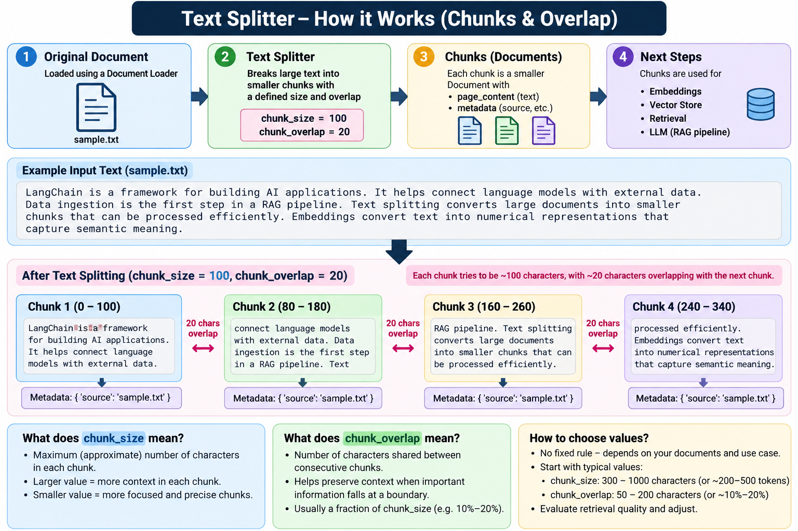

# Text Splitter

## Definition

**A Text Splitter breaks a large document into smaller chunks so the content can be processed and retrieved efficiently.**

```text
Document
   ↓
Text Splitter
   ↓
Chunk 1
Chunk 2
Chunk 3
...
   ↓
Embeddings
```

## Example

```python
from langchain_text_splitters import RecursiveCharacterTextSplitter

splitter = RecursiveCharacterTextSplitter(
    chunk_size=100,
    chunk_overlap=20
)

chunks = splitter.split_documents(documents)
```

### `chunk_size`

The approximate target size of each chunk.

### `chunk_overlap`

The amount of content shared between neighboring chunks. Overlap helps preserve context when an important sentence crosses a chunk boundary.

There is no universal value. The right settings depend on the document type and retrieval task.

## Why split?

Very large documents are not ideal for embedding and retrieval as one unit. Smaller chunks allow the retriever to return focused pieces of relevant information.

## Visual



## Repository

See `text_splitter.py`.

