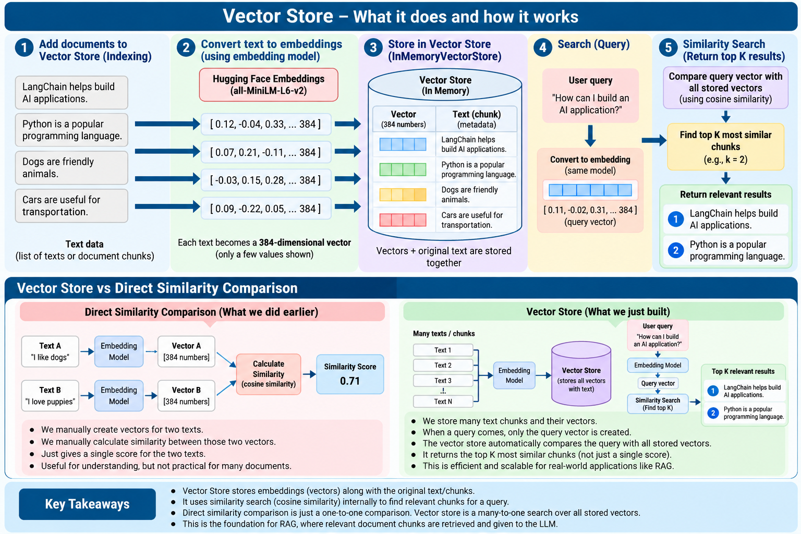
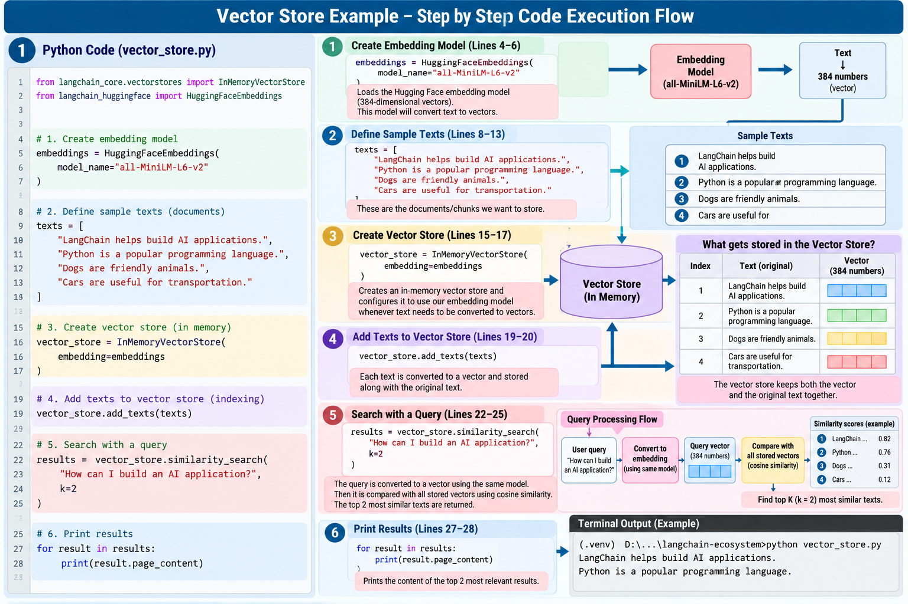

# Vector Store

## Definition

**A Vector Store stores embeddings together with their associated text and provides search capabilities over those vectors.**

In the exercise, `InMemoryVectorStore` is used for learning.

```text
Text Chunks
    ↓
Embedding Model
    ↓
Vectors + Original Text
    ↓
Vector Store
```

## Example

```python
from langchain_core.vectorstores import InMemoryVectorStore

vector_store = InMemoryVectorStore(
    embedding=embeddings
)

vector_store.add_texts(texts)

results = vector_store.similarity_search(
    "How can I build an AI application?",
    k=2
)
```

The vector store uses the configured embedding model to convert text to vectors and then searches for the most similar stored vectors.

## What happens during a query?

```text
User Query
    ↓
Query Embedding
    ↓
Compare with stored vectors
    ↓
Similarity ranking
    ↓
Top K relevant documents
```

The output is the **original text/documents**, not just similarity scores.

## In-memory vs persistent stores

`InMemoryVectorStore` is temporary and exists only while the Python process is running.

Production applications may use persistent vector databases such as FAISS, Chroma, Qdrant, Pinecone, or Azure AI Search depending on the architecture.

## Vector Store vs Retriever

| Vector Store | Retriever |
|---|---|
| Stores vectors and supports search | Provides a standard retrieval interface |
| Has store-specific search methods | Uses `invoke()` for retrieval |
| Example: `similarity_search()` | Example: `retriever.invoke()` |

## Visuals





## Repository

See `vector_store.py` and `rag_vector_store.py`.

