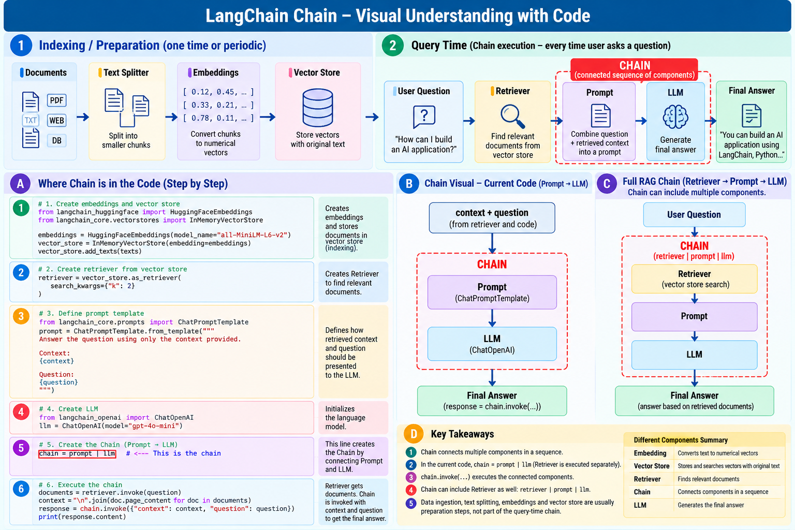

# Chain

## Definition

**A Chain connects multiple components into an executable sequence, where the output of one component becomes the input to another.**

A simple Chain:

```text
Prompt → LLM
```

In code:

```python
chain = prompt | llm
```

The `|` operator composes the components into a runnable pipeline.

## Creating and executing a Chain

```python
chain = prompt | llm

response = chain.invoke({
    "context": context,
    "question": question
})
```

So:

- `chain = ...` creates the workflow
- `chain.invoke(...)` executes it

## Important learning point

In the current exercise, the Retriever is executed separately:

```python
documents = retriever.invoke(question)
```

Then the retrieved context is passed into:

```text
Prompt → LLM
```

So the current Chain is:

```text
Context + Question
       ↓
     Prompt
       ↓
      LLM
       ↓
    Answer
```

A fuller RAG workflow can compose retrieval with prompt construction and the LLM:

```text
Question
   ↓
Retriever
   ↓
Context
   ↓
Prompt
   ↓
LLM
   ↓
Answer
```

## What Chain is NOT

A Chain is not another AI model.

It is an **orchestration/composition mechanism** for connecting components.

## Indexing vs query-time Chain

```text
INDEXING / PREPARATION

Documents → Split → Embed → Store


QUERY TIME

Question → Retrieve → Prompt → LLM → Answer
```

This distinction is important: document preparation normally happens before users start asking questions.

## Visual



## Repository

See `chain_execution.py`.

