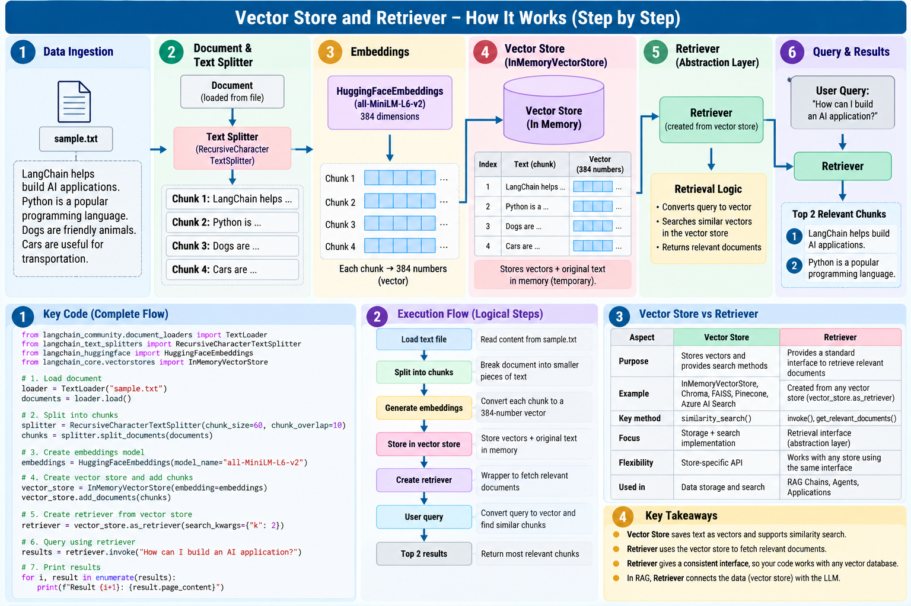

# Retriever

## Definition

**A Retriever is a standardized interface for finding and returning relevant documents for a user query.**

```text
User Question
     ↓
Retriever
     ↓
Relevant Documents
```

## Why do we need a Retriever if the Vector Store already has `similarity_search()`?

A Vector Store provides the underlying storage and search implementation.

A Retriever provides an **application-facing abstraction** for retrieval.

```text
Application
     ↓
Retriever
     ↓
Vector Store
     ↓
Similarity Search
     ↓
Documents
```

This keeps application code less tightly coupled to one particular vector-store API.

## Example

```python
retriever = vector_store.as_retriever(
    search_kwargs={"k": 2}
)

results = retriever.invoke(
    "How can I build an AI application?"
)
```

The application asks the Retriever for relevant documents rather than directly calling a store-specific search method.

## Example use case

Imagine an HR assistant with thousands of policy chunks.

```text
Employee question
      ↓
Retriever
      ↓
Relevant HR policy chunks
      ↓
Prompt
      ↓
LLM
      ↓
Answer
```

The Retriever is the bridge between stored knowledge and the answer-generation workflow.

## Visual



## Repository

See `retriever.py`.

